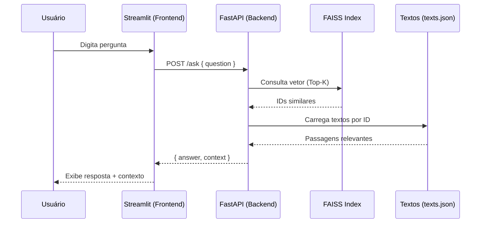
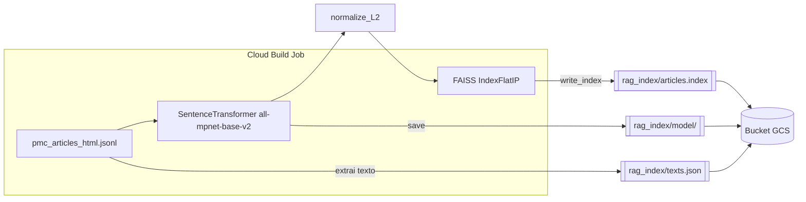

# Microbiology Farm: RAG-based Q&A System

This project implements a Retrieval-Augmented Generation (RAG) system to answer questions about a collection of microbiology articles from PubMed Central (PMC). It uses a FastAPI backend for the AI logic and a Streamlit frontend for the user interface.

## 💡 Funcionalidades (Resumo)

- Busca semântica em artigos científicos usando embeddings (SentenceTransformers `all-mpnet-base-v2`) e FAISS.
- API `/ask` (FastAPI) que recupera passagens relevantes e retorna resposta com contexto.
- Frontend em Streamlit com chat e exibição do contexto utilizado.
- Pipeline de indexação reproduzível localmente e em nuvem (GCP: Cloud Build + Cloud Storage).
- Artefatos de índice versionáveis: `rag_index/articles.index`, `rag_index/texts.json`, diretório do modelo.

## 🚀 Fluxo de Start (Local e Nuvem)

### Caminho A — Rodar Localmente

1) Dependências e variáveis de ambiente

- Requisitos: Python 3.11+, pip, virtualenv (opcional).
- Crie o arquivo `.env` na raiz com sua chave (usada pelo backend para geração de respostas):

```bash
echo 'GOOGLE_API_KEY="SUA_CHAVE_AQUI"' > .env
```

- A UI (Streamlit) usa `API_URL` para apontar para o backend. Por padrão, cai em `http://127.0.0.1:8000/ask`. Para customizar:

```bash
export API_URL="http://127.0.0.1:8000/ask"
```

2) Índice de busca (duas opções)

- Opção 2.1 — Gerar localmente (requer CPU/RAM):

```bash
python create_index.py
```

Isso cria `rag_index/articles.index` e `rag_index/texts.json`.

- Opção 2.2 — Baixar do Google Cloud Storage (se já publicado):

```bash
# Substitua pelo seu bucket
gsutil -m cp -r gs://microbiologyfarm-app-bucket/rag_index ./
```

3) Subir backend e frontend

- Com o script de conveniência:

```bash
./run.sh
```

Backend FastAPI: http://127.0.0.1:8000

Frontend Streamlit: http://localhost:8501

- Ou manualmente, em dois terminais:

```bash
# Terminal 1 (API)
uvicorn main:app --host 127.0.0.1 --port 8000 --reload

# Terminal 2 (UI)
streamlit run app.py
```

4) Teste rápido

- Abra o Streamlit, faça uma pergunta e verifique se aparece o “Context Used”.

### Caminho B — Nuvem (GCP)

1) Preparar dados no GCS

- Envie seu arquivo de dados (JSONL) para o bucket:

```bash
gsutil cp output/pmc_articles_html.jsonl gs://microbiologyfarm-app-bucket/data/pmc_articles_html.jsonl
```

2) Criar índice com Cloud Build

- O arquivo `cloudbuild.yaml` constrói a imagem indexadora e executa `create_index_cloud.py` (baixando dados do GCS, gerando FAISS e publicando `rag_index/` no bucket):

```bash
gcloud builds submit --config cloudbuild.yaml .
```

3) Deploy do Backend (Cloud Run)

- Construa e publique a imagem do backend (exemplo de tag):

```bash
docker build -t us-central1-docker.pkg.dev/SEU_PROJETO/SEU_REPO/microbiology-api:latest -f Dockerfile .
docker push us-central1-docker.pkg.dev/SEU_PROJETO/SEU_REPO/microbiology-api:latest

gcloud run deploy microbiology-service \
    --image us-central1-docker.pkg.dev/SEU_PROJETO/SEU_REPO/microbiology-api:latest \
    --platform managed \
    --region us-central1 \
    --allow-unauthenticated \
    --set-env-vars GOOGLE_API_KEY=SUa_CHAVE
```

4) Frontend usando a API em Cloud Run

- Rode o Streamlit local apontando `API_URL` para a URL do Cloud Run (ex.: `https://microbiology-service-xxxxx-uc.a.run.app/ask`).

```bash
export API_URL="https://SUA_URL_DO_CLOUD_RUN/ask"
streamlit run app.py
```

Observação: também é possível empacotar e publicar a UI em container/Cloud Run, definindo `API_URL` como variável de ambiente no serviço da UI.

## 🧭 Visão de Arquitetura

```mermaid
flowchart TD
        U[Usuário (Web)] -->|Pergunta| S[Streamlit App]
        S -->|POST /ask| A[FastAPI Backend]
        A -->|Carrega em memória| IDX[(FAISS Index)]
        A --> TXT[(texts.json)]
        subgraph GCS[Google Cloud Storage]
            GIDX[[rag_index/articles.index]]
            GTXT[[rag_index/texts.json]]
            GMODEL[[rag_index/model/]]
        end
        A <-->|Baixa no startup (se necessário)| GIDX
        A <-->|Baixa no startup (se necessário)| GTXT
        A <-->|Opcional: baixa| GMODEL
        A -->|Top-K passagens + resposta| S --> U
```

Descrição:
- O usuário interage com a UI Streamlit, que chama o backend FastAPI.
- O backend utiliza FAISS + textos tokenizados para recuperar passagens semânticas relevantes.
- Artefatos de índice/textos ficam no GCS para facilitar deploy e atualização.

## 🔎 Diagrama de Sequência (Consulta)



## 🏗️ Pipeline de Indexação (Batch)



Passos-chave:
1. Leitura do JSONL (título, resumo, seções) e montagem de textos por artigo.
2. Geração de embeddings com `all-mpnet-base-v2` e normalização L2.
3. Criação do índice FAISS (produto interno) e persistência em `rag_index/`.
4. Upload dos artefatos para o GCS via job de Cloud Build.

## What it does
-   **`create_index.py`**: Reads processed article data, generates embeddings using `sentence-transformers`, and builds a FAISS index for efficient similarity search.
-   **`main.py`**: A FastAPI application that exposes an `/ask` endpoint. It takes a user's question, retrieves relevant context from the FAISS index, and uses Google's Gemini model to generate an answer.
-   **`app.py`**: A Streamlit web application that provides a chat interface for users to interact with the backend.

## Setup
1.  Ensure Python 3.11+ is installed.
2.  Create a virtual environment:
    ```bash
    python -m venv .venv
    source .venv/bin/activate
    ```
3.  Install dependencies:
    ```bash
    pip install -r requirements.txt
    ```
4.  Create a `.env` file in the root directory and add your Google API key:
    ```
    GOOGLE_API_KEY="YOUR_API_KEY_HERE"
    ```

## Running the Application

### 1. Create the Search Index
First, you need to generate the FAISS index from your article data. Make sure you have the `output/pmc_articles_html.jsonl` file from a previous scraping step.

```bash
python create_index.py
```
This will create the `rag_index` directory containing the `articles.index` and `texts.json` files.

### 2. Run the Application
The `run.sh` script starts both the backend and frontend.

```bash
./run.sh
```
- The FastAPI backend will run on `http://127.0.0.1:8000`.
- The Streamlit frontend will be available at `http://localhost:8501`.

You can now ask questions through the Streamlit interface.

## Docker
You can also run the application using Docker.

1.  Build the Docker image:
    ```bash
    docker build -t microbiology-farm .
    ```
2.  Run the Docker container:
    ```bash
    docker run -p 8000:8000 -p 8501:8501 --env-file .env microbiology-farm
    ```
This will start the application, and you can access the Streamlit UI at `http://localhost:8501`.
